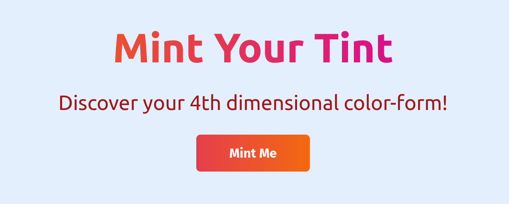

# Basic NFT minting Project
https://nft-starter-repo-final.tadhgconnolly.repl.co/

This project is me exploring how to generate NFTS and deploy smart contracts. I'm learning how to do this for a project I'm a part of to create NFT graduation certificates.

hardhat.config.js was added to .gitignore to avoid leaking my private key, without it this contract won't run locally on your machine. 